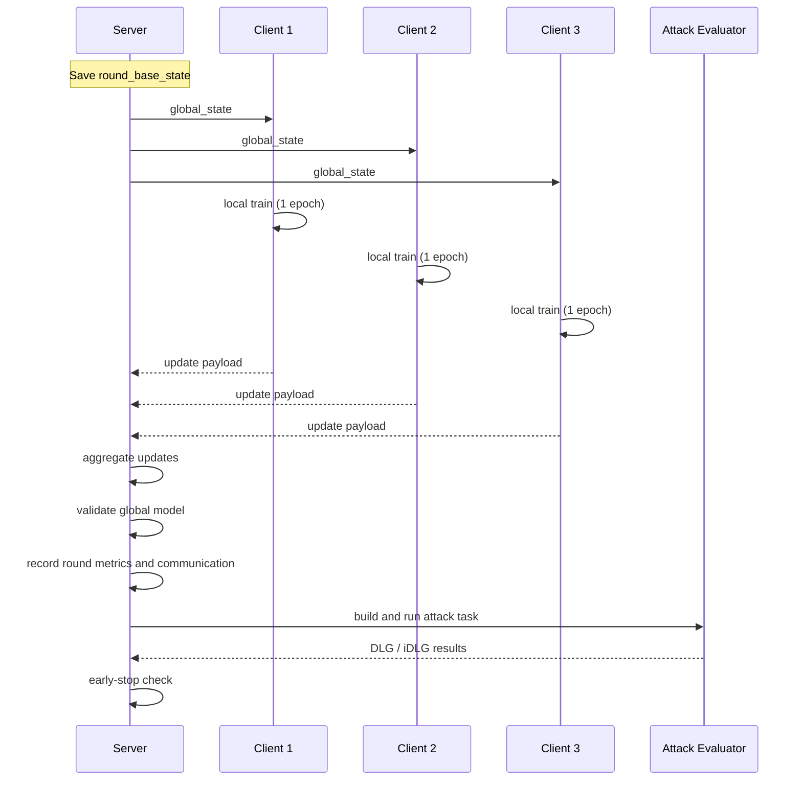
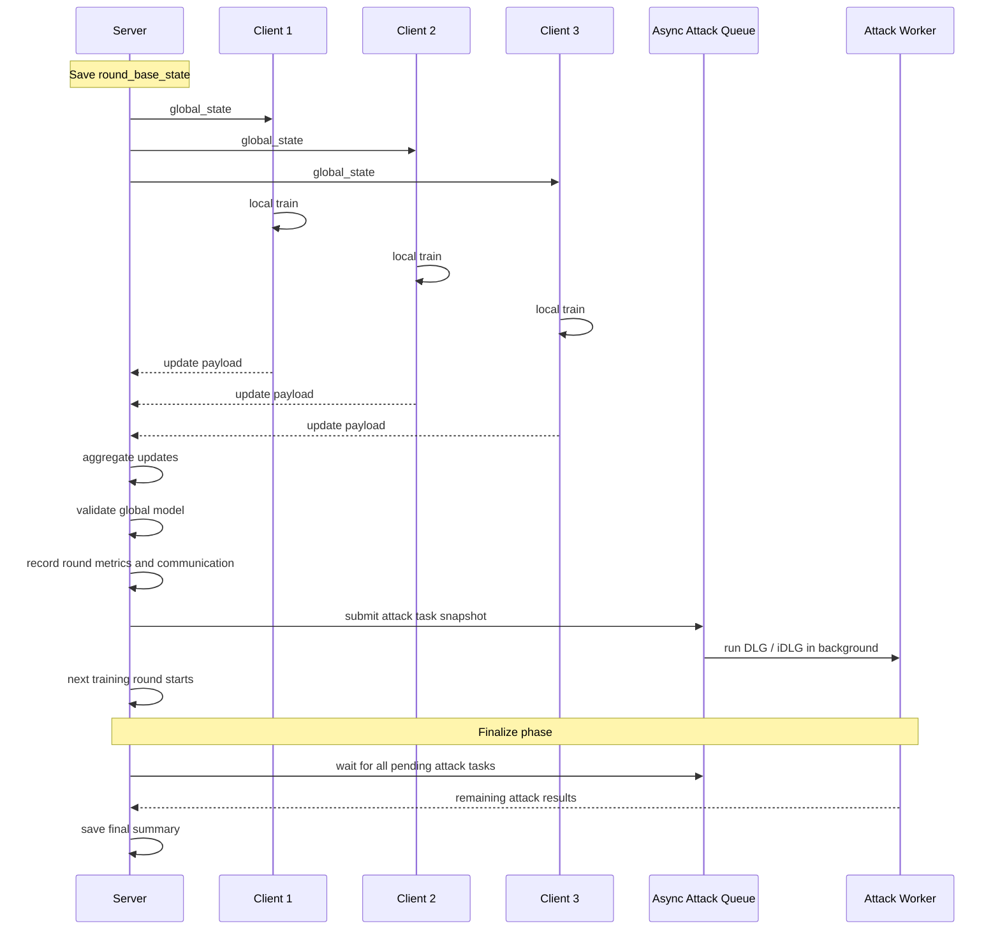
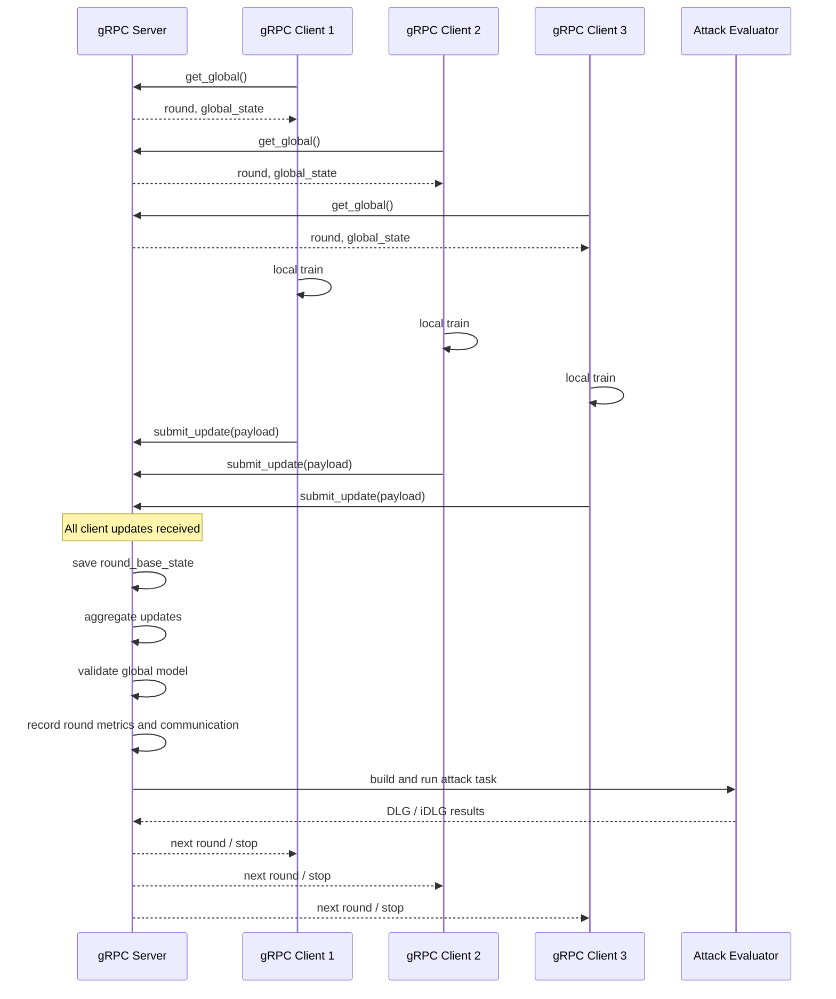
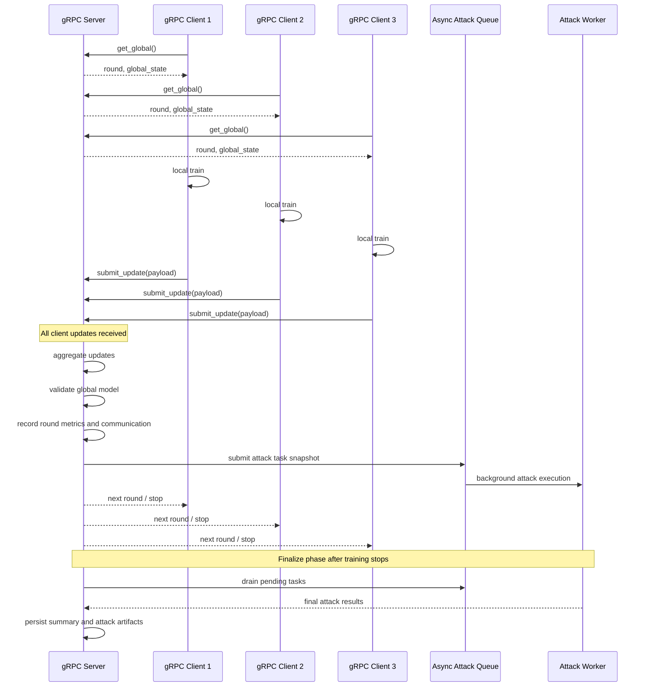
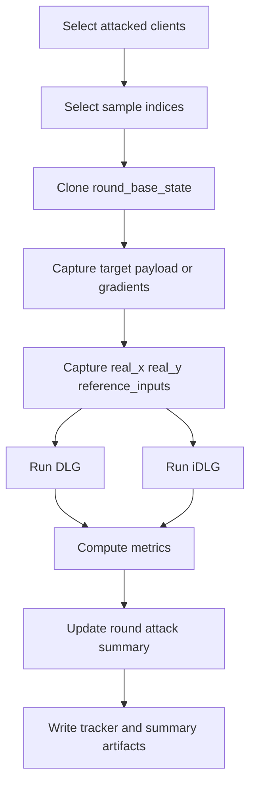

# Server-Side Attack Timeline

本文档用时序图说明当前框架中服务器端攻击与训练、聚合、评测之间的先后关系。

## 1. 单节点 FedAvg + 同步攻击

当前单节点联邦训练主循环的核心顺序是：

1. 保存聚合前全局模型 `round_base_state`
2. 各客户端基于该模型做本地训练
3. 客户端返回本轮更新
4. 服务器聚合更新
5. 服务器在验证集上评估全局模型
6. 服务器记录本轮通信量与性能
7. 服务器执行本轮攻击
8. 若早停则退出，否则进入下一轮

## 2. 单节点 FedAvg + 异步攻击

异步模式下，攻击任务内容与同步模式相同，但执行方式不同：

- 本轮训练、聚合、验证完成后
- 服务器只提交攻击任务快照
- 攻击在线程池中后台执行
- 主训练流程继续进入下一轮
- 所有轮次结束后，再等待未完成攻击统一收尾

## 3. 多节点 gRPC + 同步攻击

多节点版本在逻辑上与单节点一致，只是客户端更新通过 gRPC 传输。

关键差异是：

- 客户端先向服务器拉取全局模型
- 客户端本地训练后通过 RPC 提交更新
- 服务器收齐所有客户端的更新后，才进入聚合、验证与攻击阶段

## 4. 多节点 gRPC + 异步攻击

gRPC 异步攻击模式下：

- 客户端 RPC 热路径里不等待攻击完成
- 服务器在收齐更新并完成聚合、验证后，只提交攻击任务
- 攻击在线程池后台执行
- 服务端主循环继续推进轮次
- 训练结束时再统一等待攻击任务全部完成

## 5. 攻击任务内部的细化时序

无论是同步还是异步，单个攻击任务内部的步骤基本一致：

1. 服务器选择需要攻击的客户端
2. 为每个客户端选择一个或多个样本索引
3. 保存 `round_base_state`
4. 保存攻击目标：
   - `gradient` 模式：梯度
   - `update_payload` 模式：客户端上传的更新
5. 保存真实参考：
   - `real_x`
   - `real_y`
   - `reference_inputs`
6. 分别运行 `DLG` 与 `iDLG`
7. 计算 `MSE / PSNR / SSIM / gradient_mse`
8. 汇总成功率和平均指标

## 6. 需要特别注意的点

### 6.1 性能评测与攻击评测的先后关系

当前实现中，验证集评测发生在攻击任务提交之前。

因此：

- 攻击不会改变本轮验证集性能
- 攻击结果只影响隐私评估指标，不影响该轮模型收敛判断

### 6.2 异步攻击不会改变聚合结果

异步攻击使用的是训练流程中分离出来的快照：

- `round_base_state` 的克隆
- payload 的克隆
- 真实样本的克隆

因此异步攻击不会反向污染训练或聚合状态。

### 6.3 异步攻击仍可能影响运行速度

虽然不污染数值结果，但异步攻击会与训练竞争资源，尤其是在同一张 GPU 上运行时，会带来：

- 训练变慢
- 验证变慢
- 显存占用上升

## 7. 相关代码位置

- 单节点联邦主循环：
  - `src/fedlab/federated/algorithms.py`
- 多节点 gRPC 联邦训练：
  - `src/fedlab/communication/grpc_training.py`
- 攻击实现：
  - `src/fedlab/security/attacks.py`

