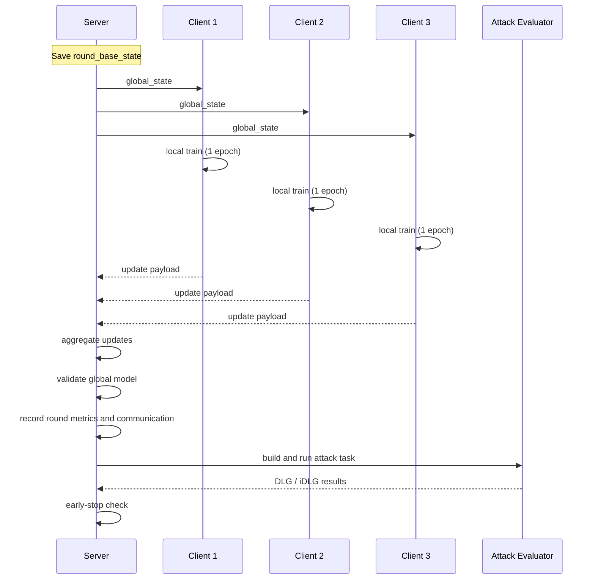
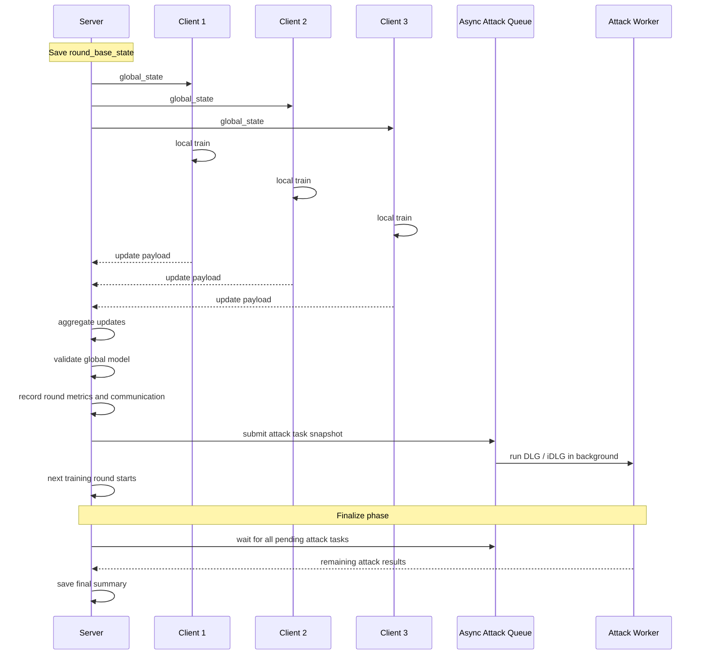
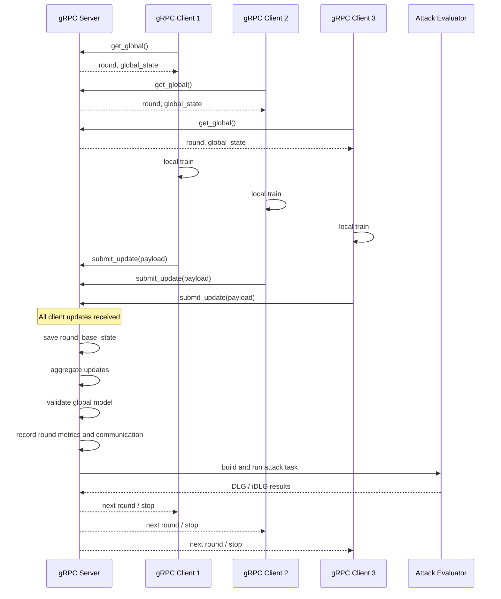
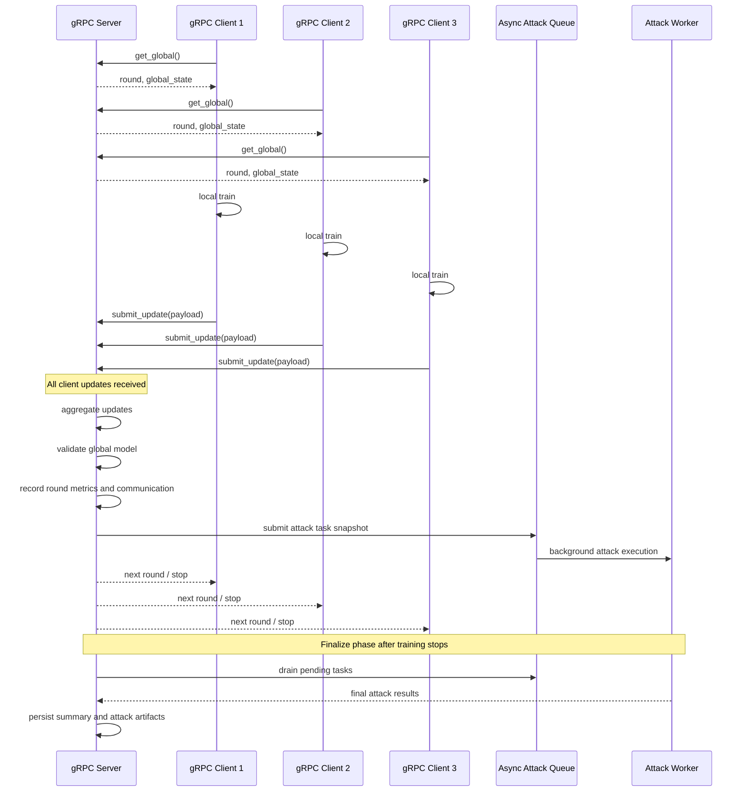
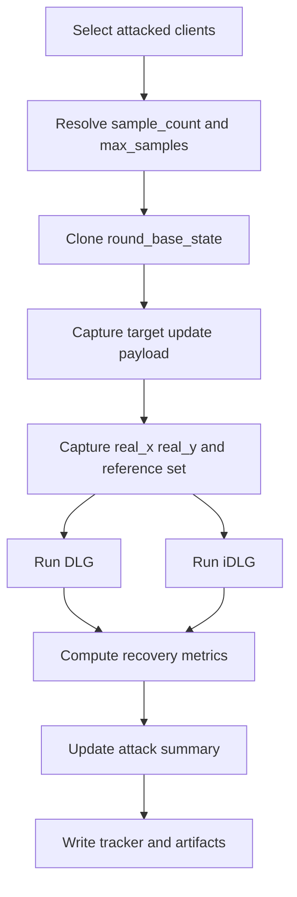

# Server-Side Attack Timeline

本文档用时序图说明当前框架中服务器端攻击与训练、聚合、评测之间的先后关系。当前代码里攻击目标统一为 `update_payload`。

## 1. 单节点 FedAvg + 同步攻击

当前单节点联邦训练主循环的核心顺序是：

1. 保存聚合前全局模型 `round_base_state`
2. 各客户端基于该模型做本地训练
3. 客户端返回本轮更新
4. 服务器聚合更新
5. 服务器在验证集上评估全局模型
6. 服务器记录本轮通信量与性能
7. 服务器执行本轮攻击
8. 若早停则退出，否则进入下一轮

## 2. 单节点 FedAvg + 异步攻击

异步模式下，攻击任务内容与同步模式相同，但执行方式不同：

- 本轮训练、聚合、验证完成后
- 服务器只提交攻击任务快照
- 攻击在线程池中后台执行
- 主训练流程继续进入下一轮
- 所有轮次结束后，再等待未完成攻击统一收尾

## 3. 多节点 gRPC + 同步攻击

多节点版本在逻辑上与单节点一致，只是客户端更新通过 gRPC 传输。

## 4. 多节点 gRPC + 异步攻击

## 5. 单个攻击任务的内部顺序

1. 服务器选择需要攻击的客户端
2. 为每个客户端确定攻击次数 `sample_count`
3. 保存 `round_base_state`
4. 保存服务器可见的 `update_payload`
5. 保存本次攻击批次 `real_x`、`real_y`
6. 保存客户端训练参考集合 `reference_inputs`、`reference_targets`
7. 分别运行 `DLG` 与 `iDLG`
8. 计算 `exact_target_mse`、`nearest_client_train_mse`、`budget_recovered_fraction`、`coverage_recovered_fraction`、`PSNR`、`SSIM`、`objective_mse`
9. 写入 `attack_results.json`、`attack_artifacts/` 和 `summary.json`

## 6. 独立回放脚本

训练流程会按攻击频率把服务器截获的更新保存到 `saved_updates/`。`replay_saved_update_attacks.py` 会按当前配置顺序重放所有已启用攻击；`replay_saved_update_dlg.py` 与 `replay_saved_update_idlg.py` 则分别只执行单一攻击。只要种子、模型模式和攻击配置保持一致，回放结果应与在线攻击保持同口径。
