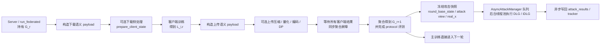
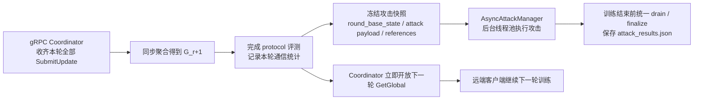

# 联邦框架四种运行形态示意图

本文补充当前仓库里联邦学习框架的四种常见运行形态示意图：

- 单节点同步
- 单节点异步
- 多节点同步
- 多节点异步

这里的“异步”严格对应当前代码中的 **异步攻击执行**，不是异步联邦聚合。
也就是说：

- 联邦训练本身仍然是按轮同步收齐客户端结果后再聚合
- 异步仅体现在 `AsyncAttackManager` 是否把攻击任务放到后台线程池执行

## 图例

- `下载语义 payload`：按 `transport.download_mode` 解释的下发内容
- `上传语义 payload`：按 `transport.upload_mode` 解释的上传内容
- `压缩/量化/编码`：算法层真正处理 payload 的地方
- `协议可见 update`：服务器聚合和攻击端最终看到的 update 视图

补充约束：

- 单节点路径支持 `download_mode=model|update`
- 多节点 gRPC 路径当前 **不支持** `download_mode=update`
- 多节点路径里，上传压缩会真实影响 gRPC 上传字节；下载压缩目前主要是客户端本地重建语义，不是服务端跨节点下发压缩

## 1. 单节点同步

```mermaid
flowchart LR
    S["Server / run_federated<br/>持有 round_base_state = G_r"] --> D0["构造下载语义 payload<br/>download_mode = model | update"]
    D0 --> D1["可选下载侧处理<br/>量化 / 编码 / 有损重建<br/>位置: method.prepare_client_state"]
    D1 --> C0["客户端实际收到模型 C_i,r<br/>作为本轮训练起点"]
    C0 --> C1["本地训练<br/>C_i,r -> L_i,r"]
    C1 --> U0["构造上传语义 payload<br/>默认: U_i,r = L_i,r - C_i,r<br/>upload_mode = update | model"]
    U0 --> U1["可选上传侧压缩 / 保护<br/>Top-k / Random-k / Sign / QSGD / int8 / EGA / DP"]
    U1 --> SV0["服务器解码为协议可见 update<br/>decompress / dequantize / decode"]
    SV0 --> B["等待所有客户端结果<br/>同步屏障"]
    B --> A["基于 client-visible base 聚合<br/>G_r+1 = B_r + Σ w_i * Ũ_i,r"]
    A --> E["protocol 评测"]
    E --> AT["同步攻击<br/>DLG / iDLG 立即执行<br/>主训练等待攻击完成"]
    AT --> N["进入下一轮"]
```

**关键点**

- 下载先有“语义 payload”，再可能发生算法相关的下载侧处理。
- 上传压缩发生在客户端本地训练完成之后、真正返回 `ClientResult` 之前。
- 服务器聚合看到的是“解码后的协议可见 update”，不是客户端训练后的完整本地模型。
- 同步模式下，攻击执行位于每轮尾部，训练主流程会等待。

## 2. 单节点异步

**关键点**

- 训练聚合仍然是同步的，异步的只有攻击任务。
- 攻击使用的是本轮快照，不会回写修改已经聚合好的 `G_r+1`。
- 异步模式的主要收益是减少主训练阻塞；主要代价是 CPU/GPU 资源竞争。

## 3. 多节点同步

```mermaid
flowchart LR
    GS["gRPC Server / Coordinator<br/>持有 global_state = G_r"] --> GD["GetGlobal RPC 下发<br/>实际跨节点发送: dense global_state + round_context"]
    GD --> RC["远端 Client 进程收到后<br/>本地调用 prepare_client_state"]
    RC --> LD["客户端本地重建下载语义<br/>当前 gRPC 仅支持 download_mode=model"]
    LD --> TR["本地训练<br/>C_i,r -> L_i,r"]
    TR --> UP0["构造上传语义 payload<br/>默认 update，也可部分算法支持 model"]
    UP0 --> UP1["客户端侧真实上传压缩<br/>Top-k / Random-k / Sign / QSGD / int8 / EGA / DP"]
    UP1 --> RPC["SubmitUpdate RPC<br/>跨节点真正发送压缩后的 ClientResult"]
    RPC --> WAIT["Coordinator 收齐全部客户端结果<br/>同步屏障"]
    WAIT --> AGG["服务器解码并聚合<br/>得到 G_r+1"]
    AGG --> EVAL["评测与记录 metrics / summary"]
    EVAL --> ATK["同步攻击<br/>当前轮等待攻击完成"]
    ATK --> NEXT["开放下一轮 GetGlobal"]
```

**关键点**

- 多节点路径里，真正跨网络的下载内容是 `global_state + round_context`，不是服务端先压缩好的算法下载 payload。
- 因此当前 gRPC 路径里，**上传压缩是跨节点真实生效的**，下载压缩更多是客户端本地重建语义。
- 服务器只有在收齐所有客户端 `SubmitUpdate` 后才会聚合并开放下一轮。

## 4. 多节点异步

**关键点**

- 多节点异步同样不是异步联邦聚合，而是“聚合后攻击异步化”。
- 下一轮是否可以开始，取决于是否已经收齐本轮客户端上传并完成聚合，不取决于攻击是否结束。
- 训练结束前服务器会统一等待攻击线程池清空，再写最终攻击产物。

## 5. 四种形态下上传/下载与压缩位置对照

| 形态 | 下载跨节点内容 | 下载压缩发生位置 | 上传跨节点内容 | 上传压缩发生位置 | 是否等待攻击 |
| --- | --- | --- | --- | --- | --- |
| 单节点同步 | 无真实网络，仅协议语义模拟 | `prepare_client_state` | 无真实网络，仅协议语义模拟 | `method.client_update` | 是 |
| 单节点异步 | 无真实网络，仅协议语义模拟 | `prepare_client_state` | 无真实网络，仅协议语义模拟 | `method.client_update` | 否 |
| 多节点同步 | `GetGlobal` 发送 dense `global_state + round_context` | 客户端本地 `prepare_client_state` | `SubmitUpdate` 发送 `ClientResult` | 客户端本地 `method.client_update` 后随 RPC 上传 | 是 |
| 多节点异步 | 同上 | 同上 | 同上 | 同上 | 否 |

## 6. 代码对应位置

- 单节点主循环：`fedlab/federated/algorithms.py`
- 异步攻击管理：`fedlab/federated/algorithms.py` 中 `AsyncAttackManager`
- 客户端下载/上传语义：`fedlab/federated/client.py`
- 传输语义函数：`fedlab/federated/protocol.py`
- 稀疏/量化/编码算法实现：`fedlab/federated/methods/`
- 多节点 gRPC 协调：`fedlab/communication/grpc_training.py`
- gRPC 传输封装：`fedlab/communication/grpc_service.py`
